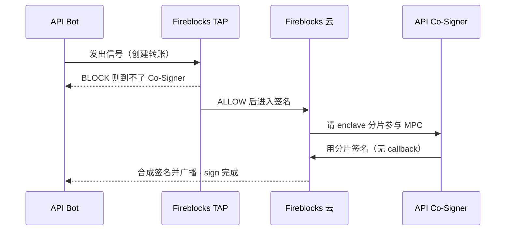

# Fireblocks Co-Sign

Operator desk for pairing a Fireblocks API bot to an [API Co-Signer](https://developers.fireblocks.com/docs/use-cosigners-for-signing-automation).

**Fireblocks workspace TAP is the only policy.** Callback is off. After TAP allows a transfer, the Co-Signer signs inside its enclave without posting this app.

## Architecture



Open the in-app diagram at `/flow`. TAP edits belong in the Fireblocks Console (or Policy Editor V2 API), documented at `/policy`.

## What you can do

- Pair a Fireblocks API user (bot) to a Co-Signer
- Read how TAP is changed in Console / API
- Simulate a TAP-allowed signing request into the local demo queue
- Read the audit log

## Run locally

```bash
npm install
npm run dev
```

Open [http://localhost:43147](http://localhost:43147).

## Callback

Off by design. Do not configure a Callback Handler URL on the Co-Signer. If none is set, Fireblocks signs TAP-allowed requests automatically.

`POST /v2/tx_sign_request` remains in this repo only so the local Simulate action can inject demo traffic. It is not part of the live path.

## Stack

Next.js, TypeScript, Tailwind, shadcn/ui. Queue state is in-memory for the Node process — reset it from Settings, and expect it to reseed on a cold start.
