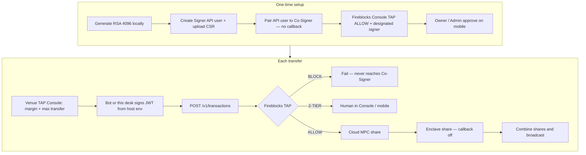

# TAP Console

Live venue TAP for Albert Hyperliquid and Albert Lighter. The Tokyo HTTP desk does **not** accept RSA PEMs and does **not** edit Fireblocks TAP.

TAP UI: http://13.196.167.126/ — Console + Accounts. Other leftover paths redirect here.
Co-Signer: us-east-1 `i-0726e50457f1cf8b2` Nitro, paired to API user `c49cc13a-b267-48eb-876c-37e4bc1eb07a`, callback off
Blocker: workspace Owner must approve the MPC key-share in the Fireblocks mobile app within 120 hours, then confirm Co-signers tab is Online

Fireblocks JWT is host env only (`FIREBLOCKS_API_KEY` / `FIREBLOCKS_SECRET_KEY` in `/opt/tap-console/.env.local`). Workspace TAP (ALLOW / BLOCK / 2-TIER) is edited in [console.fireblocks.io](https://console.fireblocks.io) → Settings → Policy Editor.

**Manual:** [docs/MANUAL.md](docs/MANUAL.md) · **Ops (do not mix machines):** [docs/OPS.md](docs/OPS.md)

## Do not mix

| Role | Where | Stores | Never stores |
| --- | --- | --- | --- |
| TAP Console / bot web | Tokyo t3.small | Venue TAP (margin trigger / max transfer). JWT only from host `.env.local` | No MPC shares, no RSA paste UI |
| API Co-Signer | Virginia c5.xlarge Nitro | Customer MPC share (enclave; ciphertext in S3 + KMS PCR8) | No frontend, no RSA bot key |
| Fireblocks SaaS | Global | Cloud MPC share + Console TAP (ALLOW / BLOCK / 2-TIER) | — |

Callback is off. ALLOW transfers that pass Fireblocks TAP are signed by the Co-Signer without a second mobile tap (Owner’s first key-share approval is the exception).

## Full path



## Run locally

```bash
npm install
npm run dev
```

Open [http://localhost:43147](http://localhost:43147).

Required env (never commit secrets, never paste into the HTTP UI):

```
FIREBLOCKS_API_KEY=
FIREBLOCKS_SECRET_KEY=
FIREBLOCKS_API_BASE=https://api.fireblocks.io
```

## Stack

Next.js, TypeScript, Tailwind, shadcn/ui. Venue TAP is in-memory. Fireblocks JWT is host env only.
