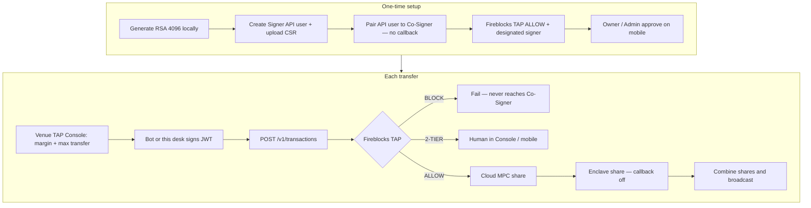

# TAP Console

Live venue TAP for Albert Hyperliquid and Albert Lighter, plus a working **Fireblocks API desk**. No demo history, no fake Co-Signer fleet.

TAP UI: http://13.196.167.126/ (Tokyo t3.small `i-029023e02658d5cb2`)
Co-Signer: us-east-1 `i-0726e50457f1cf8b2` Nitro, paired to API user `c49cc13a-b267-48eb-876c-37e4bc1eb07a`, callback off
Blocker: workspace Owner must approve the MPC key-share in the Fireblocks mobile app within 120 hours, then confirm Co-signers tab is Online

Paste a Fireblocks API key UUID and RSA private key on `/policy` (or set env vars). The server signs JWTs and calls TAP, vaults, and `POST /v1/transactions`.

**Manual:** [docs/MANUAL.md](docs/MANUAL.md) · **Ops (do not mix machines):** [docs/OPS.md](docs/OPS.md) · in-app `/ops`

## Do not mix

| Role | Where | Stores | Never stores |
| --- | --- | --- | --- |
| TAP Console / bot web | Tokyo t3.small | Venue TAP (margin trigger / max transfer), Fireblocks API JWT (API key + RSA) | No MPC shares |
| API Co-Signer | Virginia c5.xlarge Nitro | Customer MPC share (enclave; ciphertext in S3 + KMS PCR8) | No frontend, no RSA bot key |
| Fireblocks SaaS | Global | Cloud MPC share + Console TAP (ALLOW / BLOCK / 2-TIER) | — |

Callback is off. ALLOW transfers that pass Fireblocks TAP are signed by the Co-Signer without a second mobile tap (Owner’s first key-share approval is the exception).

## Full path



## Run locally

```bash
npm install
npm run dev
```

Open [http://localhost:43147](http://localhost:43147).

Optional env (never commit secrets):

```
FIREBLOCKS_API_KEY=
FIREBLOCKS_SECRET_KEY=
FIREBLOCKS_API_BASE=https://api.fireblocks.io
```

## Stack

Next.js, TypeScript, Tailwind, shadcn/ui. Venue TAP and Fireblocks credentials are in-memory for the Node process.
