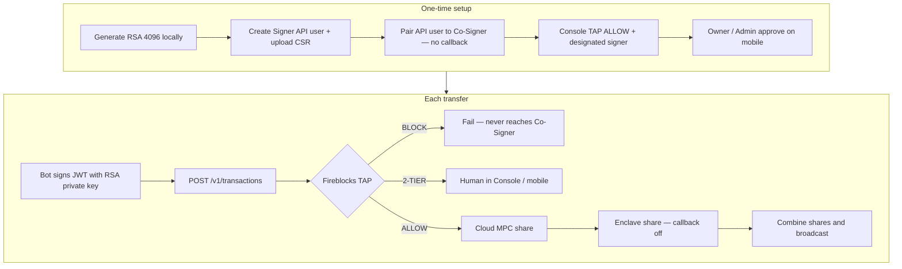

# Fireblocks Co-Sign

Operator desk for pairing a Fireblocks API bot to an [API Co-Signer](https://developers.fireblocks.com/docs/use-cosigners-for-signing-automation).

**Fireblocks workspace TAP is the only policy. Callback is off.** After TAP allows a transfer, the Co-Signer signs inside its enclave without posting this app.

**Usage manual:** [docs/MANUAL.md](docs/MANUAL.md) — RSA key, Signer API user, TAP edits, sending a transfer, and the full path.

## Full path



In-app: `/flow`.

## Run locally

```bash
npm install
npm run dev
```

Open [http://localhost:43147](http://localhost:43147).

## Stack

Next.js, TypeScript, Tailwind, shadcn/ui. Queue state is in-memory for the Node process.
