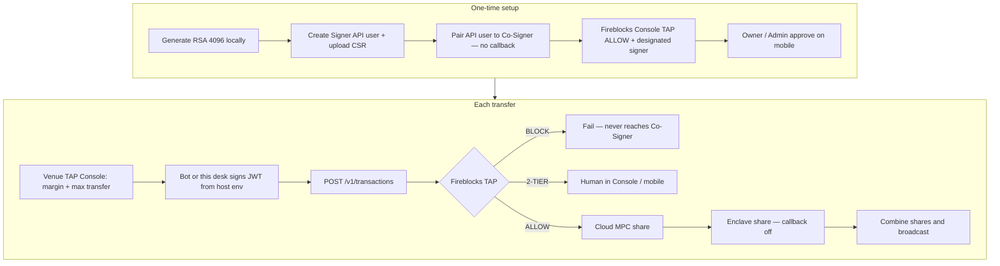

# TAP Console

Live venue TAP for Fireblocks-bound Hyperliquid / Lighter. The Tokyo HTTP desk does **not** accept RSA PEMs and does **not** edit Fireblocks TAP.

TAP UI: http://13.196.167.126/ — Console + Accounts. Other leftover paths redirect here.
Co-Signer: us-east-1 `i-0726e50457f1cf8b2` Nitro, paired to API user `c49cc13a-b267-48eb-876c-37e4bc1eb07a`, callback off, Online. Auto-sign proven for TRANSFER + TYPED_MESSAGE.

Fireblocks JWT is host env only (`FIREBLOCKS_API_KEY` / `FIREBLOCKS_SECRET_KEY` in `/opt/tap-console/.env.local`). Workspace TAP (ALLOW / BLOCK / 2-TIER) is edited in [console.fireblocks.io](https://console.fireblocks.io) → Settings → Policy Editor.

**Manual:** [docs/MANUAL.md](docs/MANUAL.md) · **Routing (HL ↔ Lighter reuse):** [docs/ROUTING.md](docs/ROUTING.md) · **Ops (do not mix machines):** [docs/OPS.md](docs/OPS.md)

## Reuse: venue-to-venue USDC (any Fireblocks vault on this flow)

Hyperliquid ↔ Lighter on one Fireblocks L1 is two named methods. Later accounts copy a catalog row; they do not rewrite signing.

| Piece | Where |
| --- | --- |
| Catalog | `src/lib/fireblocks-desk.ts` → `DESK_RAILS` / `VENUE_ROUTES` |
| Hyperliquid → Lighter | `routeHyperliquidToLighter({ amount })` |
| Lighter → Hyperliquid | `routeLighterToHyperliquid({ amount })` |
| Generic | `routeVenueFunds({ fromVenueId, toVenueId, amount })` |
| HTTP | `GET /api/fireblocks/desk` · `POST /api/fireblocks/vault/ensure` · `POST /api/fireblocks/route` `{ method, amount }` |
| Console UI | `/` → **HL ↔ Lighter** panel (Hyperliquid → Lighter or Lighter → Hyperliquid) |
| Checks | `npm run check:rails` |

```ts
import { routeHyperliquidToLighter, routeLighterToHyperliquid } from "@/lib/fireblocks-rails";

await routeHyperliquidToLighter({ amount: "2" });
await routeLighterToHyperliquid({ amount: "8" });
```

Proven live: 2 USDC HL → Lighter (Relay `depositErc20`); 8 USDC Lighter → HL Bridge2. Cookbook: [docs/ROUTING.md](docs/ROUTING.md).

Do **not** ERC20 TRANSFER to Relay Depository `0x4cd00e…`. Do **not** TRANSFER to `0xa95d9c1f…` as a Hyperliquid deposit. Do **not** use `POST /api/fireblocks/send`.

Add another Fireblocks account:

1. Allowlist Relay Depository `0x4cd00e…` and Hyperliquid Bridge2 `0x2Df1c51E…`.
2. TAP ALLOW TRANSFER, TYPED_MESSAGE, CONTRACT_CALL (and ETH_MESSAGE / APPROVE as used), designated signer = the paired API user, Co-Signer Online, callback off.
3. Host env: Fireblocks JWT; Lighter API private key (index ≥ 4) for the reverse path.
4. Add a `DESK_RAILS` row + matching `venues.ts` seeds.
5. Call the two named functions with the new venue ids.

## Do not mix

| Role | Where | Stores | Never stores |
| --- | --- | --- | --- |
| TAP Console / bot web | Tokyo t3.small | Venue TAP (margin trigger / max transfer). JWT only from host `.env.local` | No MPC shares, no RSA paste UI |
| API Co-Signer | Virginia c5.xlarge Nitro | Customer MPC share (enclave; ciphertext in S3 + KMS PCR8) | No frontend, no RSA bot key |
| Fireblocks SaaS | Global | Cloud MPC share + Console TAP (ALLOW / BLOCK / 2-TIER) | — |

Callback is off. ALLOW transfers that pass Fireblocks TAP are signed by the Co-Signer without a second mobile tap (Owner’s first key-share approval is the exception).

## Full path



## Run locally

```bash
npm install
npm run dev
```

Open [http://localhost:43147](http://localhost:43147).

Required env (never commit secrets, never paste into the HTTP UI):

```
FIREBLOCKS_API_KEY=
FIREBLOCKS_SECRET_KEY=
FIREBLOCKS_API_BASE=https://api.fireblocks.io
LIGHTER_API_PRIVATE_KEY=
LIGHTER_API_KEY_INDEX=4
LIGHTER_ACCOUNT_INDEX=747083
```

## Stack

Next.js, TypeScript, Tailwind, shadcn/ui. Venue TAP is in-memory. Fireblocks JWT is host env only.
