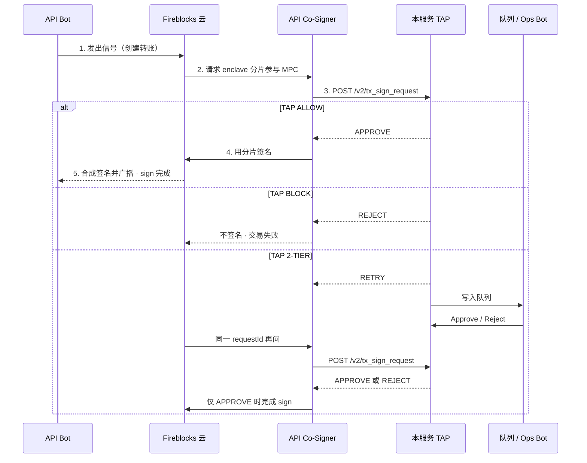
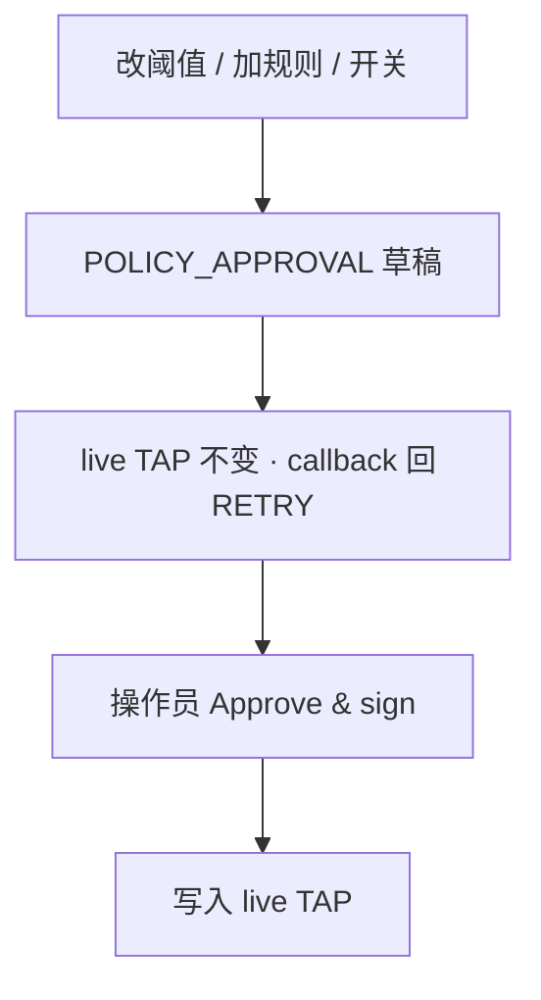

# Fireblocks Co-Sign

Callback handler and operator desk for [Fireblocks API Co-Signers](https://developers.fireblocks.com/docs/use-cosigners-for-signing-automation). Our TAP sits behind the callback: if TAP allows the request, the handler returns `APPROVE` immediately.

## Architecture





This TAP is ours, not Fireblocks workspace TAP. Configure the Co-Signer callback URL to this app origin; Fireblocks appends the path.

Policy edits (`POLICY_APPROVAL`) are always 2-TIER. Live TAP does not change until a human approves them.

Open the in-app diagram at `/flow`.

## What you can do

- Pair a Fireblocks API user (bot) to a Co-Signer and enable the callback
- Auto-approve transfers that TAP ALLOW (amount ceiling, destination type, operation)
- Hold 2-TIER matches, then approve or reject from the queue or via `/approve` / `/reject` on the ops bot
- Edit thresholds and add TAP rules — those wait for human approval
- Dry-run TAP without enqueueing: `POST /api/tap/evaluate`
- Simulate Co-Signer callbacks without Fireblocks credentials

## Run locally

```bash
npm install
npm run dev
```

Open [http://localhost:43147](http://localhost:43147).

## Callback contract

| Method | Path | Purpose |
| --- | --- | --- |
| `POST` | `/v2/tx_sign_request` | Transaction signing. TAP ALLOW → `APPROVE`. |
| `POST` | `/v2/config_change_sign_request` | Workspace configuration (held by TAP). |
| `POST` | `/api/tap/evaluate` | Same TAP, dry-run, no queue write. |

Response body (Co-Signer callback):

```json
{
  "action": "APPROVE",
  "requestId": "req_7f3c91a2",
  "rejectionReason": "optional, for REJECT"
}
```

`action` is one of `APPROVE`, `REJECT`, `RETRY`, or `IGNORE`. `IGNORE` is valid for approvals only, not signing. 2-TIER requests return `RETRY` until an operator or the ops bot decides.

Production handlers should verify the Co-Signer JWT and sign the response with RS256. This demo accepts JSON (and unsigned JWTs) so you can run it without secrets.

Example — internal vault refill matches TAP ALLOW and returns `APPROVE`:

```bash
curl -s http://localhost:43147/v2/tx_sign_request \
  -H 'content-type: application/json' \
  -d '{
    "requestId": "req_demo_1",
    "txId": "fb_tx_demo",
    "operation": "TRANSFER",
    "assetId": "ETH",
    "amountStr": "2.0",
    "amountUSD": 6600,
    "sourceType": "VAULT",
    "sourceId": "0",
    "destType": "VAULT",
    "destId": "12",
    "dstAddressType": "WHITELISTED",
    "signerId": "api_signer_treasury"
  }'
```

Dry-run the same payload against TAP only:

```bash
curl -s http://localhost:43147/api/tap/evaluate \
  -H 'content-type: application/json' \
  -d '{ "kind": "tx_sign", "amountUSD": 6600, "sourceType": "VAULT", "destType": "VAULT", "operation": "TRANSFER", "dstAddressType": "WHITELISTED" }'
```

## Stack

Next.js, TypeScript, Tailwind, shadcn/ui. Queue state is in-memory for the Node process — reset it from Settings, and expect it to reseed on a cold start.
