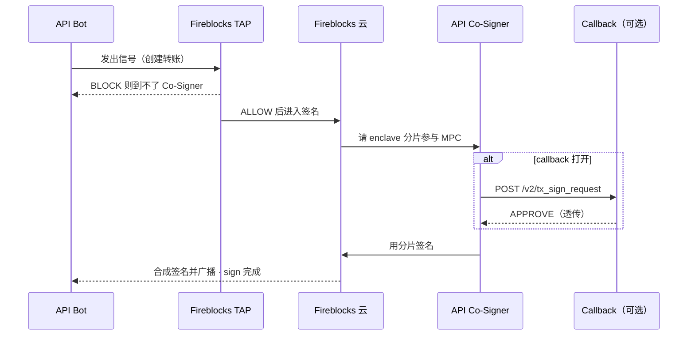

# Fireblocks Co-Sign

Callback handler and operator desk for [Fireblocks API Co-Signers](https://developers.fireblocks.com/docs/use-cosigners-for-signing-automation).

**Fireblocks workspace TAP is the only policy.** Bot-created transfers already passed it. This service does not run a second TAP. The callback returns `APPROVE` so the Co-Signer can finish the signature.

## Architecture



Open the in-app diagram at `/flow`.

## What you can do

- Pair a Fireblocks API user (bot) to a Co-Signer
- Optional callback that always returns APPROVE (audit + observability)
- Simulate Co-Signer callbacks without Fireblocks credentials
- Read the audit log of pass-through approvals

## Run locally

```bash
npm install
npm run dev
```

Open [http://localhost:43147](http://localhost:43147).

## Callback contract

| Method | Path | Purpose |
| --- | --- | --- |
| `POST` | `/v2/tx_sign_request` | Transaction signing. Always `APPROVE`. |
| `POST` | `/v2/config_change_sign_request` | Config signing. Same pass-through `APPROVE`. |

Response body:

```json
{
  "action": "APPROVE",
  "requestId": "req_7f3c91a2"
}
```

Production handlers should verify the Co-Signer JWT and sign the response with RS256. This demo accepts JSON so you can run it without secrets.

## Stack

Next.js, TypeScript, Tailwind, shadcn/ui. Queue state is in-memory for the Node process — reset it from Settings, and expect it to reseed on a cold start.
