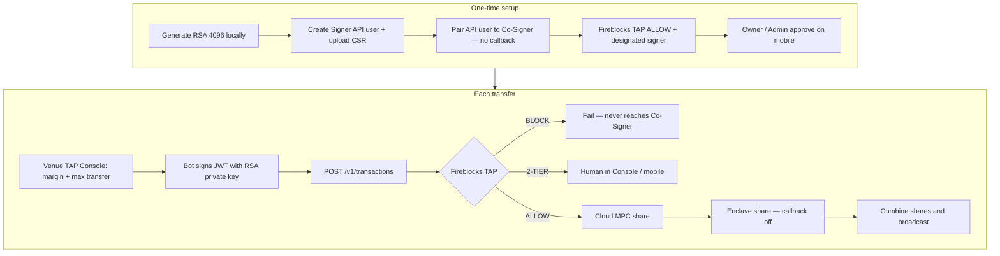

# Fireblocks Co-Sign

Operator desk for a Fireblocks Signer bot plus venue trigger TAP.

**Callback is off.** Fireblocks workspace TAP still gates signing. **TAP Console** (`/console`) sets account-margin and max-single-transfer triggers for Hyperliquid, Lighter, and MEXC.

**Usage manual:** [docs/MANUAL.md](docs/MANUAL.md)

## Full path



## Run locally

```bash
npm install
npm run dev
```

Open [http://localhost:43147/console](http://localhost:43147/console).

## Stack

Next.js, TypeScript, Tailwind, shadcn/ui. Queue and venue TAP state are in-memory for the Node process.
