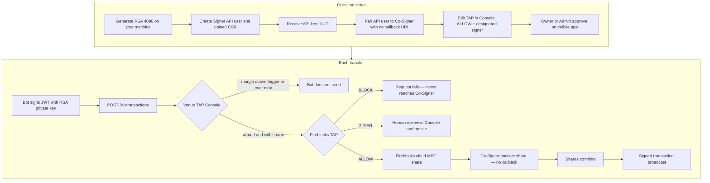
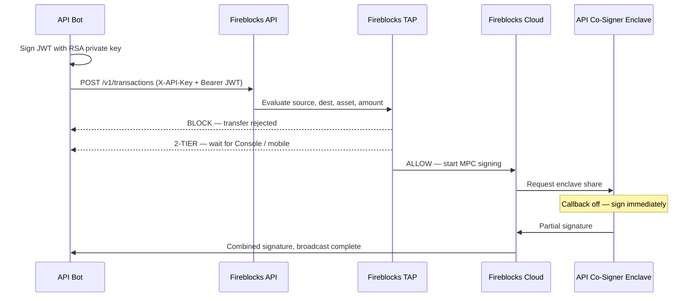

# Fireblocks Co-Sign — Operator Manual

This app sets **venue TAP** (margin trigger + max transfer) for Albert accounts and talks to the **Fireblocks API** when you paste an API key + RSA PEM.

It does not host a Co-Signer. Pair that in Fireblocks. Callback stays off.

Live Console: `/console`. Flow: `/flow`. Fireblocks TAP (live API): `/policy`. Ops split: `/ops` · [docs/OPS.md](OPS.md).

---

## TAP Console (venue triggers)

Edit **account margin** (remaining %) and **max single transfer** at `/console`.

Seeded accounts:

- `hyperliquid_albert` — Albert Hyperliquid, address `0x952e…4956`
- `lighter_albert` — Albert Lighter, `account_index` **732041**, `api_key_index` 4

When remaining margin is at or below the trigger, the bot may send a Fireblocks transfer up to that account’s max. Fireblocks TAP still has to ALLOW the transfer.

| Method | Path | Purpose |
| --- | --- | --- |
| `GET` | `/api/venues` | List venues, live balances, thresholds |
| `GET` | `/api/venues/:id` | One venue |
| `PUT` | `/api/venues/:id/thresholds` | `{ enabled, marginTriggerPct, maxTransferUsd }` |
| `PUT` | `/api/venues/:id/credentials` | Store API fields in process memory. Never written to disk. |
| `POST` | `/api/venues/evaluate` | `{ venueId, amountUsd }` → allow / cap / reasons |

---

## Fireblocks API (this desk)

Paste credentials on `/policy` or `/settings`, or set env vars. The server signs an RS256 JWT on every call (`X-API-Key` + `Authorization: Bearer`). Secrets stay in process memory.

| Env | Purpose |
| --- | --- |
| `FIREBLOCKS_API_KEY` | API user UUID |
| `FIREBLOCKS_SECRET_KEY` | RSA private key PEM (`\n` allowed) |
| `FIREBLOCKS_API_BASE` | `https://api.fireblocks.io` (US), `https://api.eu.fireblocks.io`, or sandbox |

| Method | Path | Fireblocks call |
| --- | --- | --- |
| `GET` | `/api/fireblocks/credentials` | Status only (last 4 of key). No secrets. |
| `PUT` | `/api/fireblocks/credentials` | Store `{ apiKey, privateKey, baseUrl }` or `{ clear: true }` |
| `POST` | `/api/fireblocks/credentials` | `{ action: "ping" }` → vault list |
| `GET` | `/api/fireblocks/policy` | `GET /v1/policy/active_policy?policyType=TRANSFER` |
| `GET` | `/api/fireblocks/policy/draft` | `GET /v1/policy/draft?policyType=TRANSFER` |
| `PUT` | `/api/fireblocks/policy/draft` | `PUT /v1/policy/draft` `{ policyTypes, rules }` |
| `POST` | `/api/fireblocks/policy/draft` | `POST /v1/policy/draft` `{ draftId }` publish |
| `GET` | `/api/fireblocks/vaults` | `GET /v1/vault/accounts_paged` |
| `GET` | `/api/fireblocks/vaults/:id` | `GET /v1/vault/accounts/:id` |
| `GET` | `/api/fireblocks/wallets` | External + internal wallets |
| `GET` | `/api/fireblocks/transactions` | `GET /v1/transactions` |
| `GET` | `/api/fireblocks/transactions/:id` | `GET /v1/transactions/:id` |
| `POST` | `/api/fireblocks/transactions` | `POST /v1/transactions` TRANSFER |
| `POST` | `/api/fireblocks/send` | Venue TAP gate, then create transfer |

A Signer bot can create transfers. Reading / editing TAP needs Owner / Admin / Non-Signing Admin. Publish still needs mobile approval.

Do not put `fireblocks_secret.key` or production API keys in this repository.

---

## What you need to send a transfer (bot)

| Piece | Why |
| --- | --- |
| Signer API user | Can create transactions and holds an MPC share |
| API key (UUID) | Identifies which API user is calling |
| RSA private key `fireblocks_secret.key` | Signs a JWT on **every** HTTP call, including `POST /v1/transactions`. The API key is not a password. |
| API Co-Signer pairing | Without pairing, this user has no enclave share and cannot auto-sign |
| TAP ALLOW | Source, destination, asset, amount; **designated signer** = this API user |
| No callback URL | If none is set, TAP-allowed requests are signed automatically |

This desk can submit `POST /v1/transactions` from `/policy` or Console **Send via Fireblocks**. A production bot can still call Fireblocks directly with the same JWT.

---

## Full path



Sequence of one ALLOW transfer:



---

## 1. Generate the RSA private key

Generate this **on your laptop or server**, not in the Fireblocks Console. Fireblocks only ever receives the public key (CSR).

```bash
openssl req -new -newkey rsa:4096 -nodes \
  -keyout fireblocks_secret.key \
  -out fireblocks.csr \
  -subj '/O=your_org'
```

| File | Keep where |
| --- | --- |
| `fireblocks_secret.key` | Your environment only. Signs JWTs. Never commit it. |
| `fireblocks.csr` | Upload when creating the API user |

Official guide: [Getting Started](https://developers.fireblocks.com/docs/quickstart).

---

## 2. Create the Signer API user

1. Fireblocks Console → **Developer Center → API Users → Add API user**.
2. Name the bot. Role **Signer**.
3. Upload `fireblocks.csr`.
4. After Admin Quorum approval, copy the **API key** (UUID).

The SDK uses both values:

```ts
import { FireblocksSDK } from "fireblocks-sdk";
import fs from "fs";

const fireblocks = new FireblocksSDK(
  fs.readFileSync("fireblocks_secret.key", "utf8"),
  "<API_KEY_UUID>",
);
```

An API key without the private key cannot create a transfer. Fireblocks returns 401.

---

## 3. Pair the bot to a Co-Signer (callback off)

1. Install an API Co-Signer (Intel SGX, AWS Nitro, or GCP Confidential Space).
2. Pair this Signer API user to the Co-Signer.
3. **Do not configure a Callback Handler URL.**

Fireblocks: if no Callback Handler is configured for a paired API user, the Co-Signer automatically signs or approves every request it receives for that user.

This desk’s **Bots** page is a local pairing model only. Production pairing is done on the Co-Signer host / Console.

---

## 4. Change TAP (recommended: Console)

Do this in the Console. You do not need to give anyone an API key.

1. Console → **Settings → Policy Editor**.
2. Match rules top to bottom. Strict rules first.
3. For this bot: **ALLOW**, with this API user as **designated signer**, limited to the vaults, destinations, and amounts it may move.
4. Save. Owner / Admin review **Review Policy changes**, then approve on the **Fireblocks mobile app**.

| TAP action | What happens |
| --- | --- |
| ALLOW | Paired Co-Signer signs in the enclave |
| BLOCK | Transfer fails; never reaches Co-Signer |
| 2-TIER | Human in Console / mobile — not this desk |

Optional API from this desk (Owner / Admin / Non-Signing Admin; still needs RSA JWT):

- This app: `/policy` → Load active TAP / Save draft / Publish draft
- Or Console: **Settings → Policy Editor**, then mobile approval

A Signer bot cannot read or edit TAP.

---

## 5. Send a transfer

```ts
await fireblocks.createTransaction({
  assetId: "ETH",
  source: { type: "VAULT_ACCOUNT", id: "<vaultId>" },
  destination: { type: "EXTERNAL_WALLET", id: "<whitelistId>" },
  amount: "0.05",
  externalTxId: "unique-id-from-your-bot",
});
```

Minimum body: `assetId`, `source`, `destination`, `amount`.

Then Fireblocks TAP runs. If ALLOW, the paired Co-Signer signs in the enclave.

This desk can also submit that same `POST /v1/transactions` from **Fireblocks TAP → Transfer** or Console **Send via Fireblocks** (venue TAP is checked first).

---

## 6. Run this desk locally

```bash
npm install
npm run dev
```

Open [http://localhost:43147](http://localhost:43147).

| Page | Use |
| --- | --- |
| `/` | Live Albert balances, Fireblocks connection status |
| `/console` | Venue TAP + Send via Fireblocks |
| `/policy` | Fireblocks credentials, TAP, vaults, transfers, txs |
| `/flow` | Signing path through Fireblocks TAP and Co-Signer |
| `/ops` | Tokyo vs Virginia split, remaining operator steps, what not to mix |
| `/settings` | Same Fireblocks credentials form, reset Albert TAP |

Venue and Fireblocks credentials are in-memory. A process restart drops pasted keys (env vars still load).

---

## What an API key alone can do

Nothing against Fireblocks. The UUID is an identifier. Without the matching RSA private key there is no JWT, so no read TAP, no edit TAP, no create transaction, no pairing.

Do not put `fireblocks_secret.key` or production API keys in this repository.

---

## Live machines (do not mix)

See [OPS.md](OPS.md) for instance IDs, PCR8, IAM, and remaining Owner steps.

This Tokyo desk is venue TAP + Fireblocks JWT only. The Nitro Co-Signer in `us-east-1` holds the customer MPC share. Do not attach the Co-Signer IAM role to Tokyo. Do not change the Co-Signer S3 bucket policy (Console Access Denied is expected).

Blocker: workspace Owner must approve the MPC key-share in the Fireblocks mobile app within 120 hours, then confirm Developer Center → Co-signers is Online.
