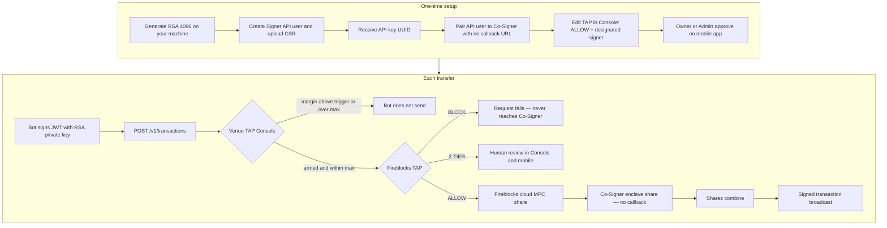
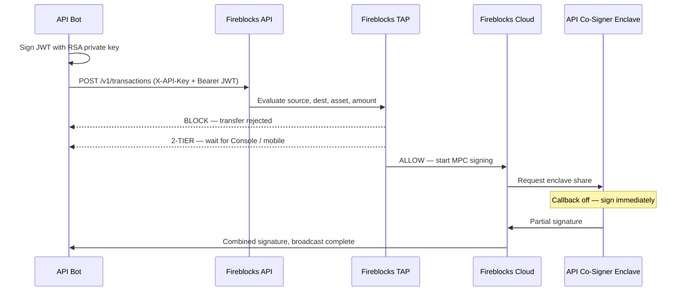

# Fireblocks Co-Sign — Operator Manual

This desk pairs a Fireblocks **Signer API bot** to an **API Co-Signer**. **Fireblocks workspace TAP** is the only policy. **Callback is off.** After TAP allows a transfer, the Co-Signer signs inside its enclave without calling this app.

Live diagram: `/flow`. Venue TAP Console: `/console`. Fireblocks TAP how-to: `/policy`. Pairing: `/bot`.

---

## TAP Console (venue triggers)

Edit **account margin** (trigger %) and **max single transfer** for Hyperliquid, Lighter, and MEXC at `/console`.

When live margin ratio is at or below the trigger, the bot may send a Fireblocks transfer up to that venue’s max. Fireblocks TAP still has to ALLOW the transfer.

| Method | Path | Purpose |
| --- | --- | --- |
| `GET` | `/api/venues` | List venues, live (or mock) balances, thresholds |
| `GET` | `/api/venues/:id` | One venue |
| `PUT` | `/api/venues/:id/thresholds` | `{ enabled, marginTriggerPct, maxTransferUsd }` |
| `PUT` | `/api/venues/:id/credentials` | Store API fields in process memory. Never written to disk. |
| `POST` | `/api/venues/evaluate` | `{ venueId, amountUsd }` → allow / cap / reasons |

Venue HTTP clients are stubbed. Paste credentials later; the adapter interface is already in `src/lib/venue-clients.ts`.

---

## What you need to send a transfer (bot)

| Piece | Why |
| --- | --- |
| Signer API user | Can create transactions and holds an MPC share |
| API key (UUID) | Identifies which API user is calling |
| RSA private key `fireblocks_secret.key` | Signs a JWT on **every** HTTP call, including `POST /v1/transactions`. The API key is not a password. |
| API Co-Signer pairing | Without pairing, this user has no enclave share and cannot auto-sign |
| TAP ALLOW | Source, destination, asset, amount; **designated signer** = this API user |
| No callback URL | If none is set, TAP-allowed requests are signed automatically |

You do **not** need this desk in the live signing path. It is an operator view of pairing, TAP instructions, and a demo queue.

---

## Full path



Sequence of one ALLOW transfer:



---

## 1. Generate the RSA private key

Generate this **on your laptop or server**, not in the Fireblocks Console. Fireblocks only ever receives the public key (CSR).

```bash
openssl req -new -newkey rsa:4096 -nodes \
  -keyout fireblocks_secret.key \
  -out fireblocks.csr \
  -subj '/O=your_org'
```

| File | Keep where |
| --- | --- |
| `fireblocks_secret.key` | Your environment only. Signs JWTs. Never commit it. |
| `fireblocks.csr` | Upload when creating the API user |

Official guide: [Getting Started](https://developers.fireblocks.com/docs/quickstart).

---

## 2. Create the Signer API user

1. Fireblocks Console → **Developer Center → API Users → Add API user**.
2. Name the bot. Role **Signer**.
3. Upload `fireblocks.csr`.
4. After Admin Quorum approval, copy the **API key** (UUID).

The SDK uses both values:

```ts
import { FireblocksSDK } from "fireblocks-sdk";
import fs from "fs";

const fireblocks = new FireblocksSDK(
  fs.readFileSync("fireblocks_secret.key", "utf8"),
  "<API_KEY_UUID>",
);
```

An API key without the private key cannot create a transfer. Fireblocks returns 401.

---

## 3. Pair the bot to a Co-Signer (callback off)

1. Install an API Co-Signer (Intel SGX, AWS Nitro, or GCP Confidential Space).
2. Pair this Signer API user to the Co-Signer.
3. **Do not configure a Callback Handler URL.**

Fireblocks: if no Callback Handler is configured for a paired API user, the Co-Signer automatically signs or approves every request it receives for that user.

This desk’s **Bots** page is a local pairing model only. Production pairing is done on the Co-Signer host / Console.

---

## 4. Change TAP (recommended: Console)

Do this in the Console. You do not need to give anyone an API key.

1. Console → **Settings → Policy Editor**.
2. Match rules top to bottom. Strict rules first.
3. For this bot: **ALLOW**, with this API user as **designated signer**, limited to the vaults, destinations, and amounts it may move.
4. Save. Owner / Admin review **Review Policy changes**, then approve on the **Fireblocks mobile app**.

| TAP action | What happens |
| --- | --- |
| ALLOW | Paired Co-Signer signs in the enclave |
| BLOCK | Transfer fails; never reaches Co-Signer |
| 2-TIER | Human in Console / mobile — not this desk |

Optional API (Owner / Admin / Non-Signing Admin only; still needs RSA JWT):

- `GET /v1/policy/active_policy?policyType=TRANSFER`
- `PUT /v1/policy/draft`
- `POST /v1/policy/draft`

A Signer bot cannot read or edit TAP.

---

## 5. Send a transfer

```ts
await fireblocks.createTransaction({
  assetId: "ETH",
  source: { type: "VAULT_ACCOUNT", id: "<vaultId>" },
  destination: { type: "EXTERNAL_WALLET", id: "<whitelistId>" },
  amount: "0.05",
  externalTxId: "unique-id-from-your-bot",
});
```

Minimum body: `assetId`, `source`, `destination`, `amount`.

Then Fireblocks TAP runs. If ALLOW, the paired Co-Signer signs in the enclave. This app is not in that path.

---

## 6. Run this desk locally

```bash
npm install
npm run dev
```

Open [http://localhost:43147](http://localhost:43147).

| Page | Use |
| --- | --- |
| `/` | Pairing summary, recent TAP-allowed signatures |
| `/flow` | Full path from JWT to broadcast |
| `/policy` | How to edit Fireblocks TAP |
| `/bot` | Pair demo API users to Co-Signers |
| `/queue` | Demo TAP-allowed history |
| `/settings` | Callback-off notes, reset demo data |

Queue state is in-memory. Reset from Settings. A process restart reseeds the demo.

`POST /v2/tx_sign_request` exists only so **Simulate TAP-allowed tx** can inject demo rows. It is not used in production with callback off.

---

## What an API key alone can do

Nothing against Fireblocks. The UUID is an identifier. Without the matching RSA private key there is no JWT, so no read TAP, no edit TAP, no create transaction, no pairing.

Do not put `fireblocks_secret.key` or production API keys in this repository.
