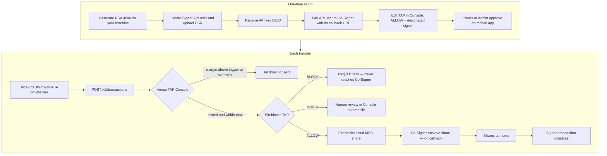
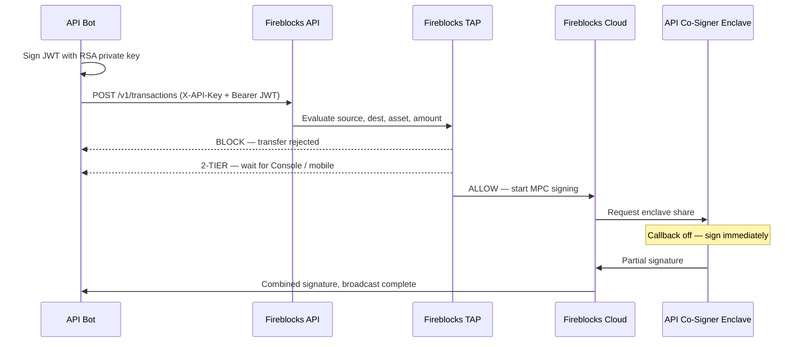
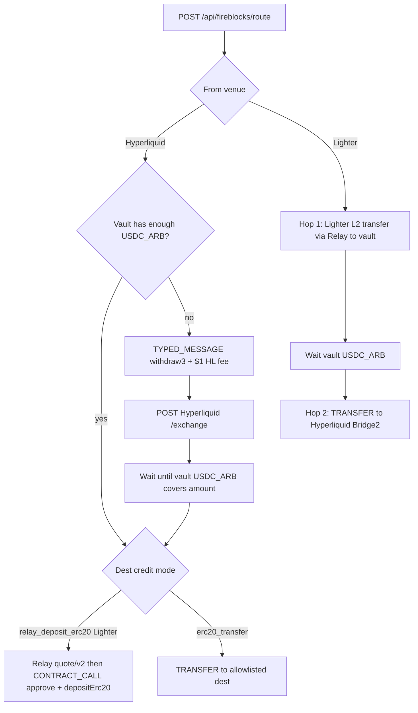

# Fireblocks Co-Sign — Operator Manual

This app sets **venue TAP** (margin trigger + max transfer) for Fireblocks-bound Hyperliquid / Lighter and can submit Fireblocks transfers when the **host** has `FIREBLOCKS_API_KEY` + `FIREBLOCKS_SECRET_KEY`. The HTTP UI does not accept RSA PEMs and does not edit Fireblocks TAP.

It does not host a Co-Signer. Pair that in Fireblocks. Callback stays off.

Live Console: `/`. Accounts: `/accounts`. Fireblocks TAP: [console.fireblocks.io](https://console.fireblocks.io) → Settings → Policy Editor. Routing cookbook: [ROUTING.md](ROUTING.md). Ops: [OPS.md](OPS.md).

---

## TAP Console (venue triggers)

Edit **account margin** (remaining %) and **max single transfer** at `/`.

Seeded accounts:

- `hyperliquid_fireblocks` — Fireblocks Hyperliquid, vault 3 (Eason Albert) address `0x6759b70EA668e076180c06085d51449FB0d7EE90`
- `lighter_fireblocks` — Fireblocks Lighter, same L1, `account_index` **747083**

Add more Hyperliquid / Lighter **read-only** watch accounts at `/accounts` (public address or account index only; not Fireblocks vaults). They persist in `accounts.local.json` on the host.

Hyperliquid equity is perp `clearinghouseState` plus spot USDC (and other USD stables). Money sitting only in spot used to look like $0 because the desk previously read perps only.

When remaining margin is at or below the trigger, the bot may send a Fireblocks transfer up to that account’s max. Fireblocks TAP still has to ALLOW the transfer.

| Method | Path | Purpose |
| --- | --- | --- |
| `GET` | `/api/venues` | List venues, live balances, thresholds |
| `POST` | `/api/venues` | Add a read-only Hyperliquid / Lighter account |
| `GET` | `/api/venues/:id` | One venue |
| `DELETE` | `/api/venues/:id` | Remove a user-added watch account |
| `PUT` | `/api/venues/:id/thresholds` | `{ enabled, marginTriggerPct, minSourceMarginPct, maxTransferUsd }` |
| `PUT` | `/api/venues/:id/credentials` | Store API fields in process memory. Never written to disk. |
| `POST` | `/api/venues/evaluate` | `{ venueId, amountUsd }` → allow / cap / reasons |

---

## Fireblocks API (this desk)

JWT comes from host env only. This HTTP site is not a place to paste RSA.

| Env | Purpose |
| --- | --- |
| `FIREBLOCKS_API_KEY` | API user UUID |
| `FIREBLOCKS_SECRET_KEY` | RSA private key PEM (`\n` allowed) |
| `FIREBLOCKS_API_BASE` | `https://api.fireblocks.io` (US), `https://api.eu.fireblocks.io`, or sandbox |

| Method | Path | Fireblocks call |
| --- | --- | --- |
| `GET` | `/api/fireblocks/credentials` | Status only (last 4 of key). No secrets. |
| `PUT` | `/api/fireblocks/credentials` | **405** — RSA is not accepted over HTTP |
| `POST` | `/api/fireblocks/credentials` | `{ action: "ping" }` → vault list |
| `GET` | `/api/fireblocks/vaults` | `GET /v1/vault/accounts_paged` |
| `GET` | `/api/fireblocks/vaults/:id` | `GET /v1/vault/accounts/:id` |
| `GET` | `/api/fireblocks/wallets` | External + internal wallets |
| `GET` | `/api/fireblocks/transactions` | `GET /v1/transactions` |
| `GET` | `/api/fireblocks/transactions/:id` | `GET /v1/transactions/:id` |
| `POST` | `/api/fireblocks/transactions` | `POST /v1/transactions` TRANSFER |
| `POST` | `/api/fireblocks/send` | Venue TAP gate, then create transfer. **Not** for HL ↔ Lighter routing (healthy remaining margin blocks it). |
| `GET` | `/api/fireblocks/desk` | Desk rails + named methods (`hyperliquidToLighter`, `lighterToHyperliquid`) |
| `POST` | `/api/fireblocks/vault/ensure` | Withdraw from Hyperliquid until vault holds `minAmount` |
| `POST` | `/api/fireblocks/route` | Named method or `from`/`to` + `amount`. Cookbook: [ROUTING.md](ROUTING.md) |
| `POST` | `/api/fireblocks/typed-message` | `POST /v1/transactions` TYPED_MESSAGE (EIP-712) |
| `POST` | `/api/fireblocks/hyperliquid/withdraw` | Sign `withdraw3` via Co-Signer, POST Hyperliquid `/exchange` |

A Signer bot can create transfers. Reading / editing Fireblocks TAP needs Owner / Admin / Non-Signing Admin in the **Fireblocks Console**. Publish still needs mobile approval.

Do not put `fireblocks_secret.key` or production API keys in this repository.

---

## What you need to send a transfer (bot)

| Piece | Why |
| --- | --- |
| Signer API user | Can create transactions and holds an MPC share |
| API key (UUID) | Identifies which API user is calling |
| RSA private key `fireblocks_secret.key` | Signs a JWT on **every** HTTP call, including `POST /v1/transactions`. The API key is not a password. |
| API Co-Signer pairing | Without pairing, this user has no enclave share and cannot auto-sign |
| TAP ALLOW | Source, destination, asset, amount; **designated signer** = this API user |
| No callback URL | If none is set, TAP-allowed requests are signed automatically |

This desk can submit `POST /v1/transactions` from Console **Send via Fireblocks**. A production bot can still call Fireblocks directly with the same JWT.

---

## Full path



Sequence of one ALLOW transfer:



---

## 1. Generate the RSA private key

Generate this **on your laptop or server**, not in the Fireblocks Console. Fireblocks only ever receives the public key (CSR).

```bash
openssl req -new -newkey rsa:4096 -nodes \
  -keyout fireblocks_secret.key \
  -out fireblocks.csr \
  -subj '/O=your_org'
```

| File | Keep where |
| --- | --- |
| `fireblocks_secret.key` | Your environment only. Signs JWTs. Never commit it. |
| `fireblocks.csr` | Upload when creating the API user |

Official guide: [Getting Started](https://developers.fireblocks.com/docs/quickstart).

---

## 2. Create the Signer API user

1. Fireblocks Console → **Developer Center → API Users → Add API user**.
2. Name the bot. Role **Signer**.
3. Upload `fireblocks.csr`.
4. After Admin Quorum approval, copy the **API key** (UUID).

The SDK uses both values:

```ts
import { FireblocksSDK } from "fireblocks-sdk";
import fs from "fs";

const fireblocks = new FireblocksSDK(
  fs.readFileSync("fireblocks_secret.key", "utf8"),
  "<API_KEY_UUID>",
);
```

An API key without the private key cannot create a transfer. Fireblocks returns 401.

---

## 3. Pair the bot to a Co-Signer (callback off)

1. Install an API Co-Signer (Intel SGX, AWS Nitro, or GCP Confidential Space).
2. Pair this Signer API user to the Co-Signer.
3. **Do not configure a Callback Handler URL.**

Fireblocks: if no Callback Handler is configured for a paired API user, the Co-Signer automatically signs or approves every request it receives for that user.

This desk’s **Bots** page is a local pairing model only. Production pairing is done on the Co-Signer host / Console.

---

## 4. Change TAP (recommended: Console)

Do this in the Fireblocks Console. The Tokyo HTTP desk cannot load or save TAP.

1. [console.fireblocks.io](https://console.fireblocks.io) → **Settings → Policy Editor**.
2. Match rules top to bottom. Strict rules first.
3. For this bot: **ALLOW**, with this API user as **designated signer**, limited to the vaults, destinations, and amounts it may move.
4. Save. Owner / Admin review **Review Policy changes**, then approve on the **Fireblocks mobile app**.

| TAP action | What happens |
| --- | --- |
| ALLOW | Paired Co-Signer signs in the enclave |
| BLOCK | Transfer fails; never reaches Co-Signer |
| 2-TIER | Human in Console / mobile — not this desk |

A Signer bot cannot read or edit TAP. This HTTP site does not expose TAP draft APIs.

---

## 5. Send a transfer

```ts
await fireblocks.createTransaction({
  assetId: "ETH",
  source: { type: "VAULT_ACCOUNT", id: "<vaultId>" },
  destination: { type: "EXTERNAL_WALLET", id: "<whitelistId>" },
  amount: "0.05",
  externalTxId: "unique-id-from-your-bot",
});
```

Minimum body: `assetId`, `source`, `destination`, `amount`.

Then Fireblocks TAP runs. If ALLOW, the paired Co-Signer signs in the enclave.

This desk can also submit that same `POST /v1/transactions` from Console **Send via Fireblocks** (venue TAP is checked first).

---

## Venue-to-venue routing (reuse this)

Cookbook for both proven walks, env, TAP, and live hashes: **[ROUTING.md](ROUTING.md)**.

Hyperliquid ↔ Lighter on the **same** Fireblocks L1 is two hops through the vault. Developers call the named functions — do not add a second transaction builder. Venue cash-out dest is the vault L1 only; **Co-Signer is required even for that hop.**

On the TAP Console home page, use the **HL ↔ Lighter** panel: pick a direction and amount, then Send. That is `POST /api/fireblocks/route`. Do not use a generic Fireblocks TRANSFER to the allowlisted dests.

| Direction | Library | HTTP |
| --- | --- | --- |
| Hyperliquid → Lighter | `routeHyperliquidToLighter({ amount: "2" })` | `POST /api/fireblocks/route` `{ "method": "hyperliquidToLighter", "amount": "2" }` |
| Lighter → Hyperliquid | `routeLighterToHyperliquid({ amount: "8" })` | `{ "method": "lighterToHyperliquid", "amount": "8" }` |

Vault withdraw from Hyperliquid is proven (`withdraw3` + Co-Signer). **Lighter credit is not a Fireblocks TRANSFER.**

The 1 USDC test (`859345ad-…` / tx `0x92de68a8…`) completed on Arbitrum as `USDC.transfer(Relay Depository, 1)` and **did not** credit Lighter account `747083`. Relay `intents/status` for that hash is `unknown`. The working live credit used Fireblocks DeFi `depositErc20` on `0x4cd00e387622c35bddb9b4c962c136462338bc31` (2 USDC: approve `14caf053-…` / deposit `eec59150-…`).

Do **not** use `POST /api/fireblocks/send` for this. That endpoint is venue TAP (remaining-margin trigger + max transfer). Healthy accounts sit at ~100% remaining, so `/send` blocks. Routing goes through Fireblocks TAP + Co-Signer only.

Before either named route signs anything, it refreshes the source venue and checks its adjustable `minSourceMarginPct` (70% by default). Hyperliquid → Lighter checks Hyperliquid; Lighter → Hyperliquid checks Lighter. The route returns a transfer error when the source margin is unavailable or below the configured floor. Configure this per account in the Console as **Minimum margin to transfer out**. Saved venue thresholds persist in `venue-thresholds.local.json` on the host.

The production auto-margin worker calls `POST /api/fireblocks/auto-margin` from a local systemd timer. It checks both seeded venues once per minute. When exactly one enabled account is armed, it routes that account's configured `maxTransferUsd` from the opposite venue through the Fireblocks vault. The normal source-margin guard still applies. Successful and failed attempts enter a persistent cooldown (`AUTO_MARGIN_COOLDOWN_MS`, 10 minutes by default) recorded in `auto-margin-state.local.json`; if both venues are armed, the worker refuses to choose a direction. The POST requires the host-only `AUTO_MARGIN_TOKEN`; `GET` returns status without secrets.



| Stage | What | Why |
| --- | --- | --- |
| `TYPED_MESSAGE` | EIP-712 `HyperliquidTransaction:Withdraw` signed by the vault | Hyperliquid `withdraw3` is not a Fireblocks TRANSFER. Co-Signer must cover **TYPED_MESSAGE**. |
| Hyperliquid `/exchange` | Broadcast `withdraw3` with `v = 27 + sig.v` | Moves USDC from HL to the vault L1 on Arbitrum. HL charges **$1** on top of the requested amount. |
| Wait vault | Poll `USDC_ARB_3SBJ` available | Bridging/credit can take minutes. |
| Lighter credit | Relay `POST /quote/v2` (`destinationChainId` **3586256**, `recipient` = Lighter `account_index`) then Fireblocks **CONTRACT_CALL** `USDC.approve` (if needed) + **CONTRACT_CALL** `depositErc20` | `0x4cd00e…` is Relay Depository. Naked ERC20 TRANSFER is not indexed. TAP must ALLOW CONTRACT_CALL to the Depository and to USDC `0xaf88…` (or leftover allowance from a prior DeFi approve). |
| Reverse hop 1 | Lighter L2 `transfer` to Relay account `731033` with memo, then Relay pays the vault L1 | Fireblocks cannot sign Lighter L2. Needs a Lighter API key (`sendTx`) plus Fireblocks RAW EIP-191 `L1Sig`. Relay L2 gas is **$1**. |
| Reverse hop 2 | Fireblocks TRANSFER native USDC to Hyperliquid **Bridge2** `0x2Df1c51E09aECF9cacB7bc98cB1742757f163dF7` | Credits the sending vault L1. Min **5 USDC**. Catalog dest `0xa95d9c1f…` is not Bridge2 — do not send there. |

`routeHyperliquidToLighter` runs Relay `quote/v2` then Fireblocks **CONTRACT_CALL** `USDC.approve` (Fireblocks APPROVE only as fallback; skipped when on-chain allowance already covers the amount) + **CONTRACT_CALL** `depositErc20`. It still refuses a naked ERC20 TRANSFER to that dest.

Vault buffer: `POST /api/fireblocks/vault/ensure` `{ "amount": "19", "railId": "eason_albert" }` withdraws from Hyperliquid until the vault holds that much (HL still takes $1 extra). Then route 2 USDC to Lighter from the vault.

Lighter → Hyperliquid is **two hops**, same as the forward path: Lighter L2 → vault, then vault → HL Bridge2. Hop 1 is quoted; sendTx still needs a Lighter API key. Do not spend the leftover vault USDC as a fake reverse.

### Library (import this)

| File | Role |
| --- | --- |
| `src/lib/fireblocks-rails.ts` | Public barrel — import this |
| `src/lib/fireblocks-desk.ts` | Catalog `DESK_RAILS` + `VENUE_ROUTES`. **Add a new Fireblocks account here.** |
| `src/lib/fireblocks-route.ts` | `routeHyperliquidToLighter` / `routeLighterToHyperliquid` / `routeVenueFunds` |
| `src/lib/fireblocks-tx.ts` | TRANSFER, TYPED_MESSAGE, ETH_MESSAGE, CONTRACT_CALL, wait, EIP-712 `r/s/v` |
| `src/lib/hyperliquid-withdraw.ts` | EIP-712 typed data + Hyperliquid `/exchange` |
| `src/lib/relay-lighter.ts` | Relay quote / status / Lighter collateral |
| `src/lib/lighter-l2.ts` | Spawn Lighter native signer |
| `docs/ROUTING.md` | Full walk for both directions |

Bot / later service:

```ts
import { routeHyperliquidToLighter, routeLighterToHyperliquid } from "@/lib/fireblocks-rails";

await routeHyperliquidToLighter({ amount: "2" });
await routeLighterToHyperliquid({ amount: "8" });
```

HTTP (same thing, live USDC):

```bash
curl -sS http://127.0.0.1:43147/api/fireblocks/desk
curl -sS -X POST http://127.0.0.1:43147/api/fireblocks/route \
  -H 'content-type: application/json' \
  -d '{"method":"hyperliquidToLighter","amount":"2"}'
curl -sS -X POST http://127.0.0.1:43147/api/fireblocks/route \
  -H 'content-type: application/json' \
  -d '{"method":"lighterToHyperliquid","amount":"8"}'
```

Proven reverse (Lighter → vault → HL, 8 USDC in): L2 `sendTx` + Fireblocks ETH_MESSAGE `611490ed-…`, Relay `0x17895448…` success, vault 36 → 43.975493, then TRANSFER `9d3f2c22-…` tx `0x37e75056…` to Bridge2. Lighter 12520.364716 → **12511.364716**. HL spot 12962.555982 → **12970.531475**. Vault back to 36.

Catalog check (no network): `npm run check:rails`.

### Add another Fireblocks account (same flow)

1. **Fireblocks Console** — create / pick the vault. Copy the L1 deposit address. Allowlist Relay Depository `0x4cd00e…` and Hyperliquid Bridge2 `0x2Df1c51E…`. Record each dest UUID.
2. **TAP** — ALLOW for this vault, those dests, asset `USDC_ARB_*`, operations **TRANSFER**, **TYPED_MESSAGE**, **CONTRACT_CALL**, and **ETH_MESSAGE**, **designated signer** = the paired API user. Co-signers Online. Callback URL empty. If TYPED_MESSAGE is missing, withdraw goes to mobile and comes back `REJECTED_BY_USER`.
3. **Host env** — Fireblocks JWT plus a Lighter API private key (index ≥ 4) in `/opt/tap-console/.env.local`.
4. **TAP Console catalog** — add one row to `DESK_RAILS` in `src/lib/fireblocks-desk.ts` (`vaultId`, `l1Address`, `arbUsdcAssetId`, dest UUIDs, TAP venue ids, `lighterAccountIndex`).
5. **TAP venues** — seed matching records in `src/lib/venues.ts` (`hyperliquid_*` address = L1, Lighter `account_index` from Lighter `accountsByL1Address`).
6. **Call** `routeHyperliquidToLighter` / `routeLighterToHyperliquid` (or `POST /api/fireblocks/route` with `method`) with the new venue ids. Do not add a second transaction builder.

Cross-vault (two different L1s) is not wired. Same-vault only.

JWT stays in host `/opt/tap-console/.env.local`. Never paste RSA into the HTTP UI. Venue TAP (`/`) and Fireblocks TAP (console.fireblocks.io) stay separate.

---

## 6. Run this desk locally

```bash
npm install
npm run dev
```

Open [http://localhost:43147](http://localhost:43147).

The pages are `/` (venue TAP) and `/accounts` (read-only Hyperliquid / Lighter watch accounts). Other paths redirect to `/`.

Venue TAP is in-memory. Fireblocks JWT is host env (`.env.local`).

---

## What an API key alone can do

Nothing against Fireblocks. The UUID is an identifier. Without the matching RSA private key there is no JWT, so no read TAP, no edit TAP, no create transaction, no pairing.

Do not put `fireblocks_secret.key` or production API keys in this repository.

---

## Live machines (do not mix)

See [OPS.md](OPS.md) for instance IDs, PCR8, IAM, and remaining Owner steps.

This Tokyo desk is venue TAP + Fireblocks JWT only. The Nitro Co-Signer in `us-east-1` holds the customer MPC share. Do not attach the Co-Signer IAM role to Tokyo. Do not change the Co-Signer S3 bucket policy (Console Access Denied is expected).

Co-signers tab is Online. Auto-sign is proven for TRANSFER, TYPED_MESSAGE, ETH_MESSAGE, and CONTRACT_CALL (callback off). Keep TAP ALLOW + designated signer when adding another vault.
