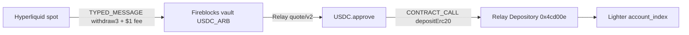
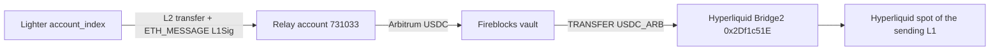

# Venue routing (developer reuse)

Hyperliquid and Lighter share one Fireblocks L1. Both directions are two hops through that vault. Later developers copy a `DESK_RAILS` row and call the named functions. Do not add a second transaction builder.

Import from `src/lib/fireblocks-rails.ts`.

Proven rail: `eason_albert` (vault 3, L1 `0x6759b70EA668e076180c06085d51449FB0d7EE90`, Lighter `747083`).

## The two methods

| Method | Direction | Call | HTTP |
| --- | --- | --- | --- |
| `routeHyperliquidToLighter` | Hyperliquid → vault → Lighter | `routeHyperliquidToLighter({ amount: "2" })` | `POST /api/fireblocks/route` `{ "method": "hyperliquidToLighter", "amount": "2" }` |
| `routeLighterToHyperliquid` | Lighter → vault → Hyperliquid | `routeLighterToHyperliquid({ amount: "8" })` | `{ "method": "lighterToHyperliquid", "amount": "8" }` |

`routeNamedVenue("hyperliquidToLighter" | "lighterToHyperliquid", { amount })` is the shared lookup. `routeVenueFunds({ fromVenueId, toVenueId, amount })` is the generic orchestrator. The two named functions pin `VENUE_ROUTES`. Pass other ids when you add a rail.

## From the TAP Console UI

Open http://13.196.167.126/ (or local `:43147`). The **HL ↔ Lighter** panel is the manual transfer.

1. Direction: **Hyperliquid → Lighter** or **Lighter → Hyperliquid**.
2. Amount in USDC. Proven: `2` forward, `8` reverse (reverse needs about 6+ so Bridge2 still gets ≥ 5 after $1 L2 gas).
3. **Send**. Confirm the live-USDC dialog. Co-Signer auto-signs if Fireblocks TAP ALLOWs.

That POST is `/api/fireblocks/route`. Venue TAP (margin trigger / Dry-run) does not move USDC.

```ts
import {
  routeHyperliquidToLighter,
  routeLighterToHyperliquid,
  VENUE_ROUTES,
} from "@/lib/fireblocks-rails";

await routeHyperliquidToLighter({ amount: "2" });
await routeLighterToHyperliquid({ amount: "8" });
```

HTTP:

```bash
# Hyperliquid → Lighter
curl -sS -X POST http://127.0.0.1:43147/api/fireblocks/route \
  -H 'content-type: application/json' \
  -d '{"method":"hyperliquidToLighter","amount":"2"}'

# Lighter → Hyperliquid
curl -sS -X POST http://127.0.0.1:43147/api/fireblocks/route \
  -H 'content-type: application/json' \
  -d '{"method":"lighterToHyperliquid","amount":"8"}'
```

Optional vault buffer first (only if the vault is short):

```bash
curl -sS -X POST http://127.0.0.1:43147/api/fireblocks/vault/ensure \
  -H 'content-type: application/json' \
  -d '{"amount":"19","railId":"eason_albert"}'
```

Do **not** use `POST /api/fireblocks/send`. That is venue TAP (remaining-margin). Healthy accounts sit near 100% remaining and `/send` blocks.

## Path A — Hyperliquid → Lighter (proven 2 USDC)

Vault already holding USDC skips the Hyperliquid withdraw.



| Hop | Who signs | What |
| --- | --- | --- |
| HL → vault | Fireblocks `TYPED_MESSAGE` EIP-712 `withdraw3`, then POST Hyperliquid `/exchange` with `v = 27 + sig.v` | Only if vault `USDC_ARB` is short. HL charges **$1** extra. |
| vault → Lighter | Relay `POST /quote/v2` (`destinationChainId` **3586256**, `recipient` = Lighter `account_index`). Fireblocks `CONTRACT_CALL` `USDC.approve` (or leftover allowance / Fireblocks `APPROVE` fallback), then `CONTRACT_CALL` `depositErc20` | `0x4cd00e…` is Relay Depository. Naked ERC20 TRANSFER does **not** credit Lighter. |

Live 2 USDC (vault already funded, no extra HL withdraw):

- Approve `14caf053-…` tx `0xd9bb4f70…`
- depositErc20 `eec59150-…` tx `0x7b2fe981…`
- Relay `0x17895430…` success
- Lighter `747083` **12518.384878 → 12520.364716** (quoted out 1.979838)

Broken path (do not repeat): TRANSFER `859345ad-…` tx `0x92de68a8…` sent 1 USDC to `0x4cd00e…` as ERC20 transfer. Relay status `unknown`. Lighter unchanged.

## Path B — Lighter → Hyperliquid (proven 8 USDC)



| Hop | Who signs | What |
| --- | --- | --- |
| Lighter → vault | Host `LIGHTER_API_PRIVATE_KEY` signs Lighter L2 `sendTx`. Fireblocks `ETH_MESSAGE` supplies EIP-191 `L1Sig`. Relay pays the vault L1 on Arbitrum | Co-Signer cannot sign Lighter L2. Relay L2 gas is **$1**. |
| vault → HL | Fireblocks `TRANSFER` native USDC to Bridge2 `0x2Df1c51E09aECF9cacB7bc98cB1742757f163dF7` | Credits the sending vault L1. **Min 5 USDC**. Do not send to catalog dest `0xa95d9c1f…`. |

Live 8 USDC:

- ETH_MESSAGE `611490ed-…`
- Relay `0x17895448…` success
- Vault 36 → 43.975493, then back to 36 after hop 2
- Lighter **12520.364716 → 12511.364716** (8 + $1)
- Bridge2 tx `0x37e75056…` (7.975493 USDC)
- HL spot **12962.555982 → 12970.531475**

Minimum Lighter amount for hop 2 to succeed: enough that Relay `currencyOut` ≥ **5** after the $1 L2 gas (about **6 USDC** in, 8 was used live).

## Host env (Tokyo `/opt/tap-console/.env.local`)

Never commit, never paste into the HTTP UI or chat.

```
FIREBLOCKS_API_KEY=
FIREBLOCKS_SECRET_KEY=
FIREBLOCKS_API_BASE=https://api.fireblocks.io
LIGHTER_API_PRIVATE_KEY=
LIGHTER_API_KEY_INDEX=4
LIGHTER_ACCOUNT_INDEX=747083
```

Path A needs Fireblocks JWT only. Path B also needs the Lighter API private key (index ≥ 4; 0–3 are the official UI). `scripts/lighter-l2.py check` verifies the key without sending.

Python: `pip install lighter-sdk`. The Next process spawns `python3 scripts/lighter-l2.py`.

## TAP (Fireblocks Console, not Tokyo venue TAP)

ALLOW + designated signer = the paired API user. Co-Signer Online. Callback empty.

| Operation | Used by |
| --- | --- |
| `TYPED_MESSAGE` | Hyperliquid `withdraw3` |
| `ETH_MESSAGE` | Lighter Relay `L1Sig` (EIP-191) |
| `TRANSFER` | vault → Hyperliquid Bridge2 |
| `CONTRACT_CALL` | Lighter `depositErc20` (and USDC approve when needed) |
| `APPROVE` | fallback if CONTRACT_CALL approve is TAP-blocked |

## Library map

| File | Role |
| --- | --- |
| `src/lib/fireblocks-rails.ts` | Public barrel — import this |
| `src/lib/fireblocks-desk.ts` | Catalog `DESK_RAILS` + `VENUE_ROUTES` |
| `src/lib/fireblocks-route.ts` | `routeNamedVenue`, `routeHyperliquidToLighter`, `routeLighterToHyperliquid`, `routeVenueFunds` |
| `src/lib/fireblocks-tx.ts` | TRANSFER, TYPED_MESSAGE, ETH_MESSAGE, CONTRACT_CALL, wait |
| `src/lib/hyperliquid-withdraw.ts` | EIP-712 `withdraw3` |
| `src/lib/relay-lighter.ts` | Relay quote / status / Lighter collateral |
| `src/lib/lighter-l2.ts` | Spawn Lighter native signer |
| `scripts/lighter-l2.py` | `check` / `sign` / `send` |
| `scripts/check-desk-rails.mts` | Catalog tests, no network: `npm run check:rails` |

## Add another Fireblocks account

1. Fireblocks Console: vault + L1 address. Allowlist Relay Depository `0x4cd00e…` and Hyperliquid Bridge2 `0x2Df1c51E…`.
2. TAP ALLOW as above. Designated signer = paired API user.
3. Register a Lighter API key (index ≥ 4) with L1 EIP-191. Put the private key in host `.env.local`.
4. Add a `DESK_RAILS` row and matching `venues.ts` seeds.
5. Call `routeHyperliquidToLighter` / `routeLighterToHyperliquid` with that rail’s venue ids.

Cross-vault (two L1s) is not wired.

## Hub rule (vault only + Co-Signer)

Hyperliquid and Lighter **cash out only to this rail's Fireblocks vault L1**. There is no direct venue↔venue hop that skips the vault.

| Leg | Destination this library will sign | Who must sign |
| --- | --- | --- |
| Hyperliquid `withdraw3` | vault L1 (`DESK_RAILS[].l1Address`) | Fireblocks Co-Signer `TYPED_MESSAGE` |
| Lighter Relay withdraw | Relay quote `recipient` = vault L1 (L2 first goes to Relay account `731033`, then Relay pays that L1) | Lighter API key (L2) **and** Co-Signer `ETH_MESSAGE` L1Sig |
| vault → Lighter | Relay Depository `depositErc20` | Co-Signer `CONTRACT_CALL` / `APPROVE` |
| vault → Hyperliquid | Bridge2 `0x2Df1c51E…` only | Co-Signer `TRANSFER` |

Even the vault hop needs the Co-Signer. Callback is off, so TAP ALLOW + designated signer auto-signs; it is still the Virginia Nitro share.

Out of this library: Lighter web/app keys 0–3, and Fireblocks Console creating a TYPED_MESSAGE / TRANSFER to some other address. Named methods refuse a non-vault cash-out dest (`assertVaultOnlyDest`).

## Do not

- ERC20 TRANSFER to Relay Depository `0x4cd00e…`
- TRANSFER to catalog dest `0xa95d9c1f…` as a Hyperliquid deposit
- Mix TAP Console (Tokyo) with the Nitro Co-Signer (Virginia)
- Paste RSA or Lighter API keys into the website or git
- Spend leftover vault USDC and call it a Lighter reverse
- Route Lighter → HL with an amount that nets under 5 USDC after the $1 L2 fee
